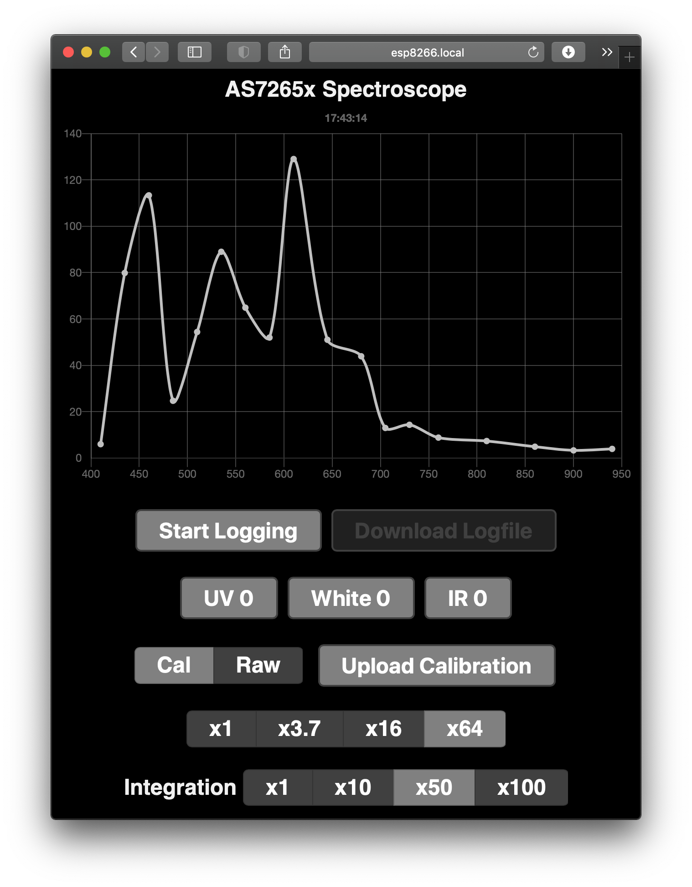

# ESP8266-AS7265x-Server

Hobby spectroscopy using [SparkFun AS7265x](https://learn.sparkfun.com/tutorials/spectral-triad-as7265x-hookup-guide), running web server on ESP8266 ([ESP-WROOM-02](https://www.switch-science.com/catalog/2346/), NodeMCU, etc.).

I use Arduino IDE, but it should run with other tools such as [PlatformIO](https://platformio.org).

## About [AS7265x](https://www.sparkfun.com/products/15050)

AS7265x has three optical sensors to obtain 18-band spectroscopic intensity between 410 and 940 nm, which means from UV to NIR. This is not a professional instrument which will cost x20 or more of this. But this is a [Maker](https://makezine.com)'s choice, isn't it?

My personal interest is to use it to measure the chromaticity of LEDs in my [kch-rgbw-lib](https://github.com/kchinzei/kch-rgbw-lib) to accurately calculate composite LED colors. I need to do it in a dark room, that's why the chart is in very dark mode.

## Requirements

- ESP8266 2MB flash or more.
- [SparkFun Triad Spectroscopy Sensor - AS7265x](https://www.sparkfun.com/products/15050)
- [AS7265x Arduino Library](https://github.com/sparkfun/SparkFun_AS7265x_Arduino_Library)
- [Arduino core for ESP8266 WiFi chip](https://github.com/esp8266/Arduino)
- [WebSocket Server and Client for Arduino](https://github.com/Links2004/arduinoWebSockets)
- [WifiManager](https://github.com/tzapu/WiFiManager)
- [Arduino ESP8266 filesystem uploader](https://github.com/esp8266/arduino-esp8266fs-plugin) or equivalent
- [Chart.min.js](https://cdnjs.cloudflare.com/ajax/libs/Chart.js/2.9.4/Chart.min.js)

## Installation

Very simplified flow is like this:
1. Wire AS7265x and ESP8266 as I2C; SDA/SCL of AS7265x to IO4/IO5 of ESP, and 3V3, GND.
1. Clone or download this repository.
1. Open ESP8266-AS7265x-Server.ino
1. You may want to change OTA password in this file. Find and modify `you_must_set_your_pw`, or simply delete this line.
1. You may also want to change Timezone and NTP servers.
1. Download [Chart.min.js](https://cdnjs.cloudflare.com/ajax/libs/Chart.js/2.9.4/Chart.min.js) and put into 'data' folder. Alternatively you can directly source it in index.html.
1. [Install Arduino core for ESP8266](https://github.com/esp8266/Arduino#installing-with-boards-manager) Select "ESP8266 Board" in Tools >> Board menu. I choose 2MB(FS:512KB OTA:~768KB) for "Flash size".
1. Also install [WebSocket Server and Client for Arduino](https://github.com/Links2004/arduinoWebSockets) and [WifiManager](https://github.com/tzapu/WiFiManager).
1. Upload contents of 'data' folder to ESP8266. You can use [Arduino ESP8266 filesystem uploader](https://github.com/esp8266/arduino-esp8266fs-plugin).
1. Compile and burn ESP8266.
1. Connect your PC/smartphone to wifi SSID `esp8266XXXXX` with `XXXXX` an hardware identifier for your ESP8266. Connecting this will prompt you to enter your Wifi setting. You must do it within 180 seconds.
1. Once it is done, you should observe a blue LED on AS7265x blinks. If not, something wrong. If OK, you should be able to connect to your ESP8266 by http://esp8266.local. And the spectroscopy is updated every 1 second. Enjoy!

## To Dos

- AS7265x setting panel (gain, LED on/off)
- [Http update instead of OTA](https://arduino-esp8266.readthedocs.io/en/latest/ota_updates/readme.html#http-server)

## References

Some part of code is written by learning from

- [A Beginner's Guide to the ESP8266](https://tttapa.github.io/ESP8266/Chap01%20-%20ESP8266.html)
- [ESP32: Webサーバ上でリアルタイムグラフ表示(Chart.js)](https://web.is.tokushima-u.ac.jp/wp/blog/2019/07/12/esp32-webサーバ上でグラフ表示chart-js/)

# License

The MIT License (MIT)
Copyright (c) K. Chinzei (kchinzei@gmail.com)
Permission is hereby granted, free of charge, to any person obtaining a copy
of this software and associated documentation files (the "Software"), to deal
in the Software without restriction, including without limitation the rights
to use, copy, modify, merge, publish, distribute, sublicense, and/or sell
copies of the Software, and to permit persons to whom the Software is
furnished to do so, subject to the following conditions:
The above copyright notice and this permission notice shall be included in
all copies or substantial portions of the Software.
THE SOFTWARE IS PROVIDED "AS IS", WITHOUT WARRANTY OF ANY KIND, EXPRESS OR
IMPLIED, INCLUDING BUT NOT LIMITED TO THE WARRANTIES OF MERCHANTABILITY,
FITNESS FOR A PARTICULAR PURPOSE AND NONINFRINGEMENT. IN NO EVENT SHALL THE
AUTHORS OR COPYRIGHT HOLDERS BE LIABLE FOR ANY CLAIM, DAMAGES OR OTHER
LIABILITY, WHETHER IN AN ACTION OF CONTRACT, TORT OR OTHERWISE, ARISING FROM,
OUT OF OR IN CONNECTION WITH THE SOFTWARE OR THE USE OR OTHER DEALINGS IN
THE SOFTWARE.
